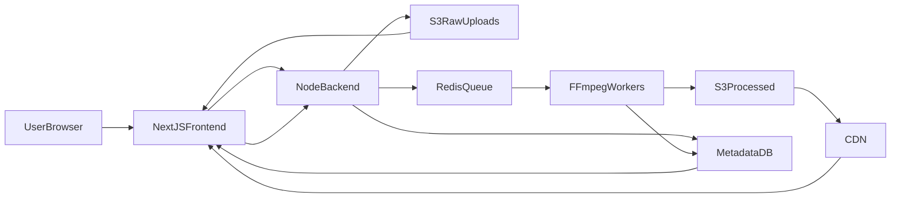

## Video Platform Architecture & Roadmap

### High-level assumptions

- **Transcoding target**: HLS adaptive streaming with multiple resolutions (e.g. 1080p, 720p, 480p, 360p).
- **Metadata store**: Relational DB (e.g. Postgres) accessed by the Node.js backend.
- **Auth**: Existing auth in Next.js; video access control enforced at backend/CDN.
- **Queue**: Redis-based reliable queue (or Redis Streams) with at-least-once semantics.

---

### 1. System architecture breakdown

#### 1.1 Components & responsibilities

- **Next.js frontend**
  - **Upload UI** (chunked uploads, progress, retry, cancel/resume).
  - **Watch UI** (video player, quality selection, subtitles, thumbnails).
  - **Account & library pages** (list videos, statuses, analytics surface).
  - **Authentication & session** integration.
- **Upload Gateway (Node.js backend)**
  - **Pre-signed S3 URL generation** per file/chunk.
  - **Upload session management** (video ID, user ID, expected variants, integrity checks).
  - **Webhook or completion API** that client calls after successful upload.
  - **Enqueue transcode jobs** when upload completes.
  - **Video metadata API** (create, update, fetch, list) for frontend.
- **Redis Queue**
  - Stores **transcode jobs** with payload (videoId, inputKey, outputBaseKey, profile set, priority, attempts).
  - Provides **visibility timeouts**, **retries**, **DLQ** routing.
- **Worker Fleet (Docker + FFmpeg)**
  - **Job consumer**: pulls jobs from Redis, locks them, reports heartbeats.
  - **Transcoding pipeline**: FFmpeg-based generation of HLS master + variant playlists and segments.
  - **Thumbnail & preview** generation.
  - **Artifact upload**: pushes HLS assets back to S3.
  - **Status updates** in DB and notifications (e.g. WebSocket / SSE / polling).
- **Storage (AWS S3)**
  - **Raw uploads bucket/folder** for originals.
  - **Processed assets bucket/folder** for HLS, thumbnails, subtitles.
  - **Lifecycle rules** for archiving or deleting originals.
- **Metadata & Control Plane (DB + Backend)**
  - **Video table** (id, owner, status, visibility, createdAt, etc.).
  - **TranscodeJob / Rendition table** (resolution, bitrate, status, errorReason).
  - **Playback manifest metadata** (S3 paths, DRM flags, duration, size).
- **CDN / Edge**
  - **CloudFront (or similar)** in front of processed S3 bucket.
  - Caching of HLS playlists & segments.
  - Signed URLs or cookies for restricted content.
- **Observability stack**
  - Centralized **logging** from backend and workers.
  - **Metrics** (queue depth, job latency, FFmpeg failure rate, S3 errors).
  - **Tracing** (optional) for request → job → worker flow.

#### 1.2 Data flow

- **Upload path**: User uploads via pre-signed URLs → S3 raw → frontend notifies backend → backend writes metadata and enqueues job.
- **Processing path**: Workers pull job from Redis → download from S3 raw → FFmpeg → upload HLS artifacts to S3 processed → update DB.
- **Playback path**: Frontend requests playback → backend returns manifest/URL → CDN serves HLS playlist/segments from S3 processed.

---

### 2. Development roadmap (phased)

#### Phase 1: Solidify core upload & metadata layer

- **Task 1.1**: Define DB schema for `users`, `videos`, `video_renditions`, `transcode_jobs`.
- **Task 1.2**: Implement backend endpoints for:
  - Create upload session (returns `videoId`, pre-signed URLs or upload parameters).
  - Mark upload complete and enqueue transcode job.
  - Retrieve video by ID (with renditions & status).
  - List user videos with pagination.
- **Task 1.3**: Implement Next.js upload UI with:
  - Chunked upload (if needed) and resumability.
  - Progress indicator and basic failure handling.
  - Final "upload complete" call to backend.
- **Task 1.4**: Implement S3 buckets and IAM roles:
  - `videos-raw` and `videos-processed` or logical prefixes.
  - Least-privilege IAM for backend and workers.

#### Phase 2: Robust worker & queue architecture

- **Task 2.1**: Design and implement a `TranscodeJob` abstraction:
  - Job structure, priorities, state machine (PENDING, RUNNING, FAILED_RETRYABLE, FAILED_FATAL, COMPLETED).
- **Task 2.2**: Implement Redis-based queue wrapper:
  - Enqueue with TTL, visibility timeout, and backoff.
  - Acknowledge or requeue on failure/timeout.
  - Separate DLQ storage (Redis list or dedicated stream).
- **Task 2.3**: Build worker service:
  - Dockerized Node.js or Go worker.
  - Job polling, locking, heartbeat, and cooperative shutdown.
  - Graceful shutdown hooks (complete current job, update status).
- **Task 2.4**: Integrate worker with DB and S3:
  - Fetch video metadata from DB.
  - Download input from S3 raw.
  - Upload output to S3 processed and update DB references.

#### Phase 3: FFmpeg pipeline & HLS streaming

- **Task 3.1**: Define transcoding profiles (resolution, bitrate, audio codec) per rendition.
- **Task 3.2**: Implement FFmpeg command orchestration:
  - Single pass to generate HLS master + variants.
  - Configurable presets (e.g. 1080p, 720p, 480p, 360p).
- **Task 3.3**: Implement thumbnail extraction (e.g. at 10% and 50% duration).
- **Task 3.4**: Design S3 layout for HLS assets and integrate with CDN.
- **Task 3.5**: Implement playback API and Next.js player page (HLS.js or native support).

#### Phase 4: Concurrency, scalability, and robustness

- **Task 4.1**: Stress-test concurrent uploads and job ingestion.
- **Task 4.2**: Implement backpressure controls (rate limiting, max concurrent jobs per user).
- **Task 4.3**: Add autoscaling hooks for worker fleet based on queue depth and processing latency.
- **Task 4.4**: Introduce priority queues (e.g. premium users, short videos).
- **Task 4.5**: Implement and tune retry policies, DLQ processing tools, and operational runbooks.

#### Phase 5: Observability and production hardening

- **Task 5.1**: Centralize logs (structured JSON, correlation IDs).
- **Task 5.2**: Expose and scrape metrics (queue size, processing times, error rates).
- **Task 5.3**: Dashboards for system health and per-video lifecycle.
- **Task 5.4**: Alerts for backlog, high error rates, and S3/FFmpeg failures.
- **Task 5.5**: Implement security features: authz for uploads/playback, signed URLs, WAF, input validation.
- **Task 5.6**: Roll out rate limiting, API quotas, and upload size restrictions.

#### Phase 6: UX and advanced features

- **Task 6.1**: Live status updates on upload and processing state (WebSockets/SSE or polling).
- **Task 6.2**: Video management UI (edit title/description, privacy, delete).
- **Task 6.3**: Analytics for creators (views, watch time, geographic breakdown later).
- **Task 6.4**: Optional: subtitles/captions pipeline, DRM, multi-audio tracks.

---

### 3. Concurrency handling

#### 3.1 Concurrent uploads

- **Approach**:
  - Use **pre-signed S3 URLs** so the Node backend does not proxy video bytes.
  - Leverage **multipart uploads** for large files and better failure recovery.
  - Store upload session state (videoId, parts, checksums) in DB or Redis.
- **Handling**:
  - Client uploads directly to S3, possibly in multiple concurrent parts per file.
  - Backend only handles small JSON/metadata requests, so it scales with CPU-bound logic not bandwidth.

#### 3.2 Potential bottlenecks

- **Backend**:
  - Bottleneck if it were proxying uploads → mitigated by pre-signed URLs.
  - Metadata DB contention on heavy write patterns → mitigate with connection pooling, indexes, and batching.
- **Redis**:
  - Single Redis instance CPU/IO under heavy queue load → cluster or Redis Enterprise, or move heavy queueing to a dedicated service.
- **Workers**:
  - FFmpeg is CPU and disk IO heavy; per-node concurrency must be capped.
  - S3 bandwidth from workers; parallel downloads/uploads must be tuned.

#### 3.3 Improvements

- **Upload-side**:
  - Implement client-side **backoff and retry** on S3 errors.
  - Enforce **max concurrent uploads per user** at the backend.
- **Queue-side**:
  - Shard queues by priority or user tier to reduce head-of-line blocking.
  - Use **rate limiting** when enqueuing jobs (e.g. per user per minute) to avoid queue explosion.
- **Worker-side**:
  - Use a **worker concurrency limiter** (e.g. max 1–2 jobs per CPU core, or based on FFmpeg performance metrics).

---

### 4. Worker architecture

#### 4.1 Worker lifecycle

- **Startup**:
  - Load config (Redis URL, S3 credentials, transcoding profiles).
  - Connect to Redis and DB.
  - Register heartbeat/healthcheck endpoint.
- **Run loop**:
  - Poll Redis for jobs with short backoff when idle.
  - Acquire lock/visibility (mark job as RUNNING with lease until heartbeat).
  - Process one job at a time or limited concurrent jobs.
  - On completion, mark job COMPLETED and ack in queue.
- **Shutdown**:
  - Stop fetching new jobs.
  - Finish in-progress jobs or gracefully fail and requeue.
  - Flush logs/metrics.

#### 4.2 Job processing flow

- **Step 1**: Deserialize job payload and validate schema.
- **Step 2**: Fetch video and rendition metadata from DB; verify state.
- **Step 3**: Download input file from S3 to local temp storage.
- **Step 4**: Run FFmpeg pipeline to generate HLS and thumbnails.
- **Step 5**: Upload all artifacts to S3 processed bucket.
- **Step 6**: Update DB with output locations, durations, and sizes.
- **Step 7**: Mark job DONE or FAILED with error detail.

#### 4.3 Retry strategies

- **Retryable vs fatal**:
  - Network or transient S3/Redis errors → retry.
  - FFmpeg exit on input corruption or unsupported codec → mark as fatal, no retries.
- **Backoff**:
  - Exponential backoff with jitter on retryable failures.
  - Max attempts per job (e.g. 5) before routing to DLQ.
- **Idempotency**:
  - Jobs should be **idempotent**: repeated processing overwrites the same S3 keys safely.
  - Use idempotency keys (jobId) for DB updates.

#### 4.4 Failure handling

- **Per-job failure**:
  - Mark job FAILED, store errorReason, surface error to frontend.
- **DLQ handling**:
  - Separate DLQ list/stream with job payload and final error.
  - Periodic or manual reprocessing after inspection.
- **Worker crashes**:
  - Rely on Redis visibility timeouts: jobs without heartbeat become re-deliverable.
  - Metrics/alerts for jobs stuck RUNNING for too long.

---

### 5. Video processing pipeline

#### 5.1 FFmpeg structure

- **Input normalization**:
  - Normalize audio codec, video codec, and container before HLS.
  - Enforce common frame rate (e.g. 30 fps) where appropriate.
- **Single-pass HLS generation**:
  - Use FFmpeg to output multiple variant streams in one command, e.g. with filter_complex scaling.
  - Use `-preset` and `-crf` tuned for quality vs speed.

#### 5.2 Resolution generation

- **Profiles** (example):
  - `1080p`: 1920x1080 @ ~5–8 Mbps.
  - `720p`: 1280x720 @ ~3–5 Mbps.
  - `480p`: 854x480 @ ~1–2 Mbps.
  - `360p`: 640x360 @ ~0.7–1 Mbps.
- **Dynamic profile selection**:
  - Determine max resolution based on input video resolution.
  - Avoid upscaling beyond source resolution.

#### 5.3 HLS pipeline

- **Output structure**:
  - One master playlist `.m3u8` referencing per-resolution variant playlists.
  - Each variant playlist references `.ts` or `.fmp4` segments.
- **Segment settings**:
  - Segment duration 4–6 seconds.
  - Use keyframe alignment across variants.
- **Encryption (optional later)**:
  - AES-128 or SAMPLE-AES key handling.
  - DRM integration if needed.

---

### 6. Storage structure

#### 6.1 S3 folder structure

- **Raw uploads (bucket `videos-raw`)**:
  - `raw/{userId}/{videoId}/source/{originalFilename}`
  - `raw/{userId}/{videoId}/uploads/{uploadSessionId}/parts/`* (for multipart, if needed).
- **Processed assets (bucket `videos-processed`)**:
  - `videos/{videoId}/master.m3u8`
  - `videos/{videoId}/1080p/index.m3u8`
  - `videos/{videoId}/1080p/seg-00001.ts`
  - `videos/{videoId}/720p/...`
  - `videos/{videoId}/thumbnails/thumb-0001.jpg`
- **Benefits**:
  - Easy per-video cleanup and lifecycle rules.
  - Simple mapping from `videoId` to asset paths.

#### 6.2 Metadata storage strategy

- **DB tables** (example fields):
  - `videos`: `id`, `userId`, `title`, `description`, `status` (UPLOADING, PROCESSING, READY, FAILED), `visibility`, `duration`, `createdAt`, `updatedAt`.
  - `video_renditions`: `id`, `videoId`, `resolution`, `bitrate`, `codec`, `status`, `manifestPath`, `createdAt`.
  - `transcode_jobs`: `id`, `videoId`, `attempt`, `state`, `errorReason`, `startedAt`, `finishedAt`.
- **Indexes**:
  - `videos(userId, createdAt)` for listing user content.
  - `video_renditions(videoId)` for quick joins.
- **Cache**:
  - Use Redis or in-process cache for hot playback metadata.

---

### 7. Queue architecture

#### 7.1 Message format

- **TranscodeJob message** (JSON):
  - `id`: job UUID.
  - `videoId`: associated video ID.
  - `inputKey`: S3 key for original file.
  - `outputBaseKey`: base S3 path for processed assets.
  - `profiles`: list of profiles or a named preset.
  - `attempt`: current attempt count.
  - `createdAt`, `priority`, `traceId`.

#### 7.2 Visibility timeout

- **Duration**:
  - Based on max expected processing time plus buffer (e.g. 30–60 minutes for long videos).
  - Workers must extend visibility (heartbeat) on long jobs.
- **Behavior**:
  - If worker fails to ack before timeout, job becomes visible and may be retried by another worker.

#### 7.3 Dead letter queues

- **DLQ design**:
  - Separate Redis list/stream per queue.
  - Store full payload, final error message, and timestamps.
- **Operations**:
  - Admin tooling to inspect and optionally re-enqueue.
  - Metrics/alerts on DLQ growth.

---

### 8. Scalability strategy

#### 8.1 Scaling workers

- **Horizontal scaling**:
  - Run workers as Docker containers orchestrated by ECS/Kubernetes/Nomad.
  - Scale replica count based on **queue depth** and **job age**.
- **Vertical limits**:
  - Limit FFmpeg concurrency per host.
  - Tune CPU/memory per worker pod/instance.

#### 8.2 Autoscaling ideas

- **Metrics-based autoscaling**:
  - Target max queue depth per worker (e.g. < 10 jobs per worker).
  - Target P95 job wait time (e.g. < 5 minutes).
- **Warm pool**:
  - Maintain a minimum worker count to avoid cold-start delays.
- **Cost control**:
  - Use cheaper spot instances for non-urgent transcodes and on-demand for priority queues.

#### 8.3 Handling large traffic spikes

- **Ingress control**:
  - Apply **rate limits** on upload creation per user/IP.
  - Use queue quotas to prevent unbounded backlog.
- **Graceful degradation**:
  - Temporarily reduce number of renditions for non-priority users.
  - Defer expensive features (e.g. 4K renditions) under load.

---

### 9. Observability

#### 9.1 Logging

- **Structured logging**:
  - JSON logs with `traceId`, `videoId`, `jobId`, `userId` where relevant.
- **Centralization**:
  - Ship logs to a central store (e.g. CloudWatch, ELK, or OpenSearch).
- **Log levels**:
  - INFO for lifecycle events (job start/finish).
  - WARN for recoverable issues.
  - ERROR for failures, with stack traces and FFmpeg stderr snippets.

#### 9.2 Metrics

- **Key metrics**:
  - Queue depth, job throughput (jobs/min), job latency (enqueue → complete).
  - FFmpeg failure rate per error type.
  - Average and P95 upload size and duration.
  - Worker CPU/mem usage.
- **Playback metrics** (later via frontend analytics):
  - Startup time, buffering events, error rate per player version.

#### 9.3 Monitoring & alerting

- **Dashboards**:
  - Upload health, queue/worker health, playback health.
- **Alerts**:
  - High queue depth or job age.
  - High FFmpeg error rate.
  - S3 error spikes.
  - Reduced worker fleet capacity.

---

### 10. Production improvements

#### 10.1 Security

- **Access control**:
  - Enforce user ownership checks for upload and video management.
  - Use signed URLs or cookies for private video playback via CDN.
- **Network**:
  - Restrict S3 and Redis access to VPC.
  - Use HTTPS everywhere and TLS for Redis.
- **Secrets**:
  - Store credentials in a secure vault (e.g. AWS Secrets Manager, SSM).

#### 10.2 Rate limiting

- **Per-IP and per-user** limits on:
  - Upload session creation.
  - Metadata API calls.
- **Global limits**:
  - Protect backend from abusive traffic.

#### 10.3 Upload validation

- **Client-side**:
  - Validate file size, extension, and type before requesting pre-signed URLs.
- **Server-side**:
  - Enforce max file size via S3 upload policies.
  - Validate MIME types and reject disallowed types.
  - Run a lightweight media probe (FFprobe) before transcoding.

#### 10.4 CDN streaming

- **Setup**:
  - Configure CloudFront (or similar) with S3 processed bucket as origin.
  - Enable caching for HLS segments and playlists.
- **Access control**:
  - Signed URLs (short TTL) for private videos.
  - Geo-blocking or WAF rules if needed.

---

### 11. Final monorepo structure

Use a Turborepo-style monorepo (or similar) to organize services:

- **Root**
  - `apps/`
    - `web/` (Next.js frontend)
    - `api/` (Node.js backend APIs & upload gateway)
    - `worker-transcode/` (worker service for FFmpeg & job processing)
  - `packages/`
    - `config/` (shared ESLint, TS config, Prettier, etc.)
    - `queue/` (Redis queue client abstraction, job schema, retry logic)
    - `ffmpeg/` (shared FFmpeg profile definitions and command builders)
    - `models/` (shared TypeScript types and DB models, if using Prisma/TypeORM/Drizzle)
    - `logging/` (shared logger setup and middleware)
    - `metrics/` (Prometheus/OpenTelemetry helpers)
    - `utils/` (shared utilities, error types, constants)
  - `infra/`
    - `terraform/` or `cdk/` (S3, Redis, ECS/K8s, CloudFront, IAM, etc.)
    - `k8s/` (if applicable: deployments, services, HPA configs)
  - `scripts/`
    - Local dev scripts (seed data, queue inspection, DLQ replayer).
  - `README.md`, `turbo.json`, root `package.json`, etc.

This structure keeps frontend, backend, and workers aligned around shared interfaces (job schemas, FFmpeg profiles, logging/metrics) while allowing independent deployment and scaling.

---

### Actionable step-by-step roadmap (condensed)

1. **Define schemas & storage**: Design DB tables for videos/jobs/renditions; create S3 buckets and IAM roles; document S3 key structure.
2. **Implement upload flow**: Add backend APIs for upload sessions and completion; integrate pre-signed URLs; build Next.js upload UI and session tracking.
3. **Wire up queue**: Implement Redis queue wrapper; define job message format; enqueue jobs on upload completion.
4. **Build worker service**: Create Dockerized worker; implement job polling, FFmpeg integration, S3 handling, and DB updates; add retry and DLQ logic.
5. **Create HLS pipeline**: Define transcoding profiles; generate HLS master/variants and thumbnails; store outputs using agreed S3 structure; expose playback endpoints.
6. **Integrate CDN & player**: Configure CDN with processed bucket; implement Next.js video player using HLS.js; hook up metadata and access control.
7. **Harden concurrency & scaling**: Add upload and enqueue rate limiting; tune worker concurrency; implement autoscaling based on queue metrics; add priority queues if needed.
8. **Add observability**: Roll out structured logging, metrics, dashboards, and alerts across backend and workers.
9. **Security & validation**: Enforce ownership checks, signed playback URLs, S3 policies, and media validation (FFprobe).
10. **UX & operations**: Implement real-time status updates, management UI, admin tools for DLQ and backlog handling, and documentation/runbooks for on-call engineers.

